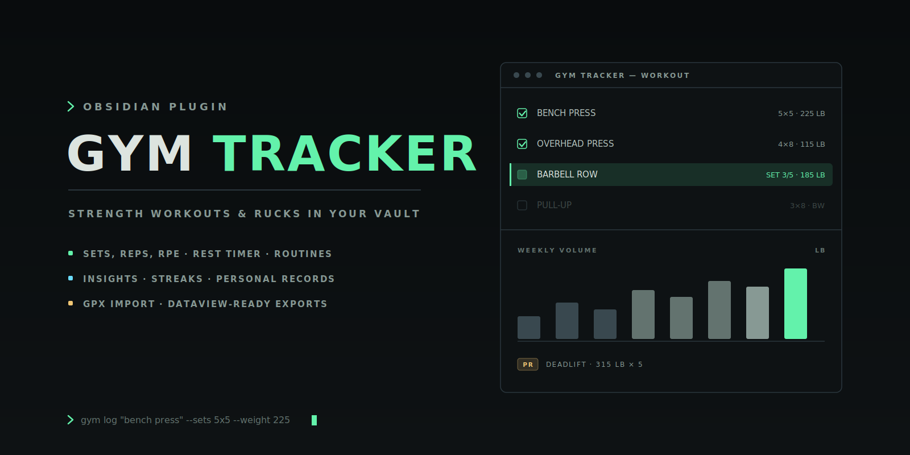

<div align="center">

  

  **Track strength workouts and rucks inside Obsidian — sets, reps, RPE, routines, insights, streaks, and personal records, on desktop and mobile.**

  [](LICENSE)
  [](https://github.com/Real-Fruit-Snacks/obsidian-gym-tracker/releases)
  [](https://obsidian.md)

  [Documentation](https://real-fruit-snacks.github.io/obsidian-gym-tracker/) · [Report an issue](https://github.com/Real-Fruit-Snacks/obsidian-gym-tracker/issues) · [Contributing](CONTRIBUTING.md)

</div>

---

## Overview

Your training log belongs next to your notes, not in another subscription app. Gym Tracker keeps structured workout data inside Obsidian: log strength sessions and rucks as you train, review volume trends and personal records in Insights, and export sessions as Dataview-friendly Markdown notes. The layout is responsive, so it works the same on your phone at the gym as it does on your desktop.

## Features

- **Detailed logging** — log strength workouts with exercises, sets, reps, weight, RPE, RIR, completion state, and notes, with a built-in rest timer.
- **Ruck tracking** — track rucks with distance, duration, pack weight, elevation gain, route, RPE, pace, and load-distance.
- **GPX import** — import a GPX file and the ruck's date, distance, duration, elevation gain, and route name are filled in automatically.
- **Routines** — save routines, edit them later, and load them into a new workout.
- **Insights & calendar** — review weekly volume, workout totals, ruck mileage, streaks, exercise progress, progression suggestions, and personal records; browse workouts by month in the Calendar.
- **Exercise library** — search a built-in library of common lifts and jump straight from an exercise to its history.
- **Export & backup** — export workouts to Dataview-friendly Markdown with YAML frontmatter, and create a full JSON backup from the command palette.

## Installation

**Requires Obsidian 1.5.0 or newer.**

### Community plugins (recommended)

1. Open **Settings → Community plugins → Browse**.
2. Search for **Gym Tracker**, then **Install** and **Enable**.

### Manual

Download `main.js`, `manifest.json`, and `styles.css` from the [latest release](https://github.com/Real-Fruit-Snacks/obsidian-gym-tracker/releases/latest) into `<your-vault>/.obsidian/plugins/gym-tracker/`, then enable Gym Tracker under **Settings → Community plugins**.

### From source

```bash
git clone https://github.com/Real-Fruit-Snacks/obsidian-gym-tracker.git
cd obsidian-gym-tracker
npm install
npm run build
```

Copy or symlink the repository into `<your-vault>/.obsidian/plugins/gym-tracker/`, then reload Obsidian and enable the plugin.

## Getting started

1. **Open Gym Tracker** — click the dumbbell ribbon icon or run **Open gym tracker** from the command palette.
2. **Log a session** — build a strength or ruck draft, load a routine, import a GPX file, run the rest timer, and save.
3. **Review and export** — check Insights for trends and records, then export sessions as Markdown notes for the rest of your vault.

### Views

| View | What it's for |
| --- | --- |
| Workout | Build a strength or ruck draft, load routines, import GPX files, run the rest timer, and save the session |
| Insights | Totals, weekly trends, exercise progress, progression suggestions, and personal records |
| Calendar | Browse workouts by date and create a workout for a selected day |
| Routines | Start, edit, or delete reusable workout templates |
| Library | Filter exercises, add your own, inspect history, edit, or delete entries |
| History | Review, edit, export, or delete saved workouts |

### Commands

| Command | Description |
| --- | --- |
| Open gym tracker | Open the Gym Tracker view |
| Export latest workout to note | Write the most recent workout to a Markdown note |
| Export tracker backup JSON | Create a portable JSON backup in the export folder |
| Load demo data | Fill the tracker with sample data to explore the views |
| Clear tracker data | Reset the tracker to a blank state |

### Settings

| Setting | Default | Description |
| --- | --- | --- |
| Weight unit | `lb` | Used for labels and exports |
| Auto-export workouts | Off | Create or update the Markdown workout note after each save |
| Link exercise notes | On | Use wiki links for exercises in exported workout notes |
| Create exercise notes | Off | Automatically create missing exercise notes when saving a workout |
| Default rest timer | `120` | Default rest duration in seconds |
| Default workout type | `Strength` | Pre-filled when you start a new workout |
| Export folder | `Gym/Workouts` | Folder where exported workout notes are created |
| Exercise folder | `Gym/Exercises` | Folder where exercise notes are created |

## GPX import

Switch a workout to **Ruck** mode and select **Import GPX**. Gym Tracker calculates route distance from the GPX track points, elevation gain from positive elevation changes, and elapsed duration from the first and last timestamps. Enter pack weight and RPE after import to calculate load-distance and preserve how the ruck felt.

## Data and privacy

Workout data is stored through Obsidian's plugin data storage, inside your vault. GPX files are read locally in the Obsidian app. Gym Tracker never sends workout or location data to an external service — the plugin makes no network requests at all.

Run **Gym Tracker: Export tracker backup JSON** from the command palette any time to create a portable backup in your configured export folder.

## Dataview examples

Exported workout notes carry YAML frontmatter, so Dataview queries work out of the box.

**Recent workouts:**

```dataview
TABLE date, workout_type, duration_minutes, volume, set_count
FROM "Gym/Workouts"
WHERE record_type = "workout"
SORT date DESC
```

**Rucks:**

```dataview
TABLE date, distance, distance_unit, duration_minutes, pack_weight, pace_minutes_per_mi
FROM "Gym/Workouts"
WHERE workout_mode = "ruck"
SORT date DESC
```

**Bench press sessions:**

```dataview
TABLE date, volume, set_count
FROM "Gym/Workouts"
WHERE contains(exercises, "Bench Press")
SORT date DESC
```

## Architecture

```
obsidian-gym-tracker/
├── manifest.json        Plugin metadata
├── versions.json        Plugin version → minimum Obsidian version map
├── src/main.ts          Plugin source (TypeScript, single file)
├── styles.css           Plugin styles
├── esbuild.config.mjs   Build configuration
└── docs/                Documentation site and artwork
```

- **Single-file source** — the whole plugin lives in `src/main.ts`, bundled with esbuild.
- **Safe writes** — the only notes the plugin creates or updates are the exports you ask for (workout notes, exercise notes, backups), inside the folders you configure.
- **No network, no telemetry** — the plugin never talks to the network.

## Contributing

Contributions are welcome — see [CONTRIBUTING.md](CONTRIBUTING.md) and [CODE_OF_CONDUCT.md](CODE_OF_CONDUCT.md) for guidelines on pull requests and issues.

## License

Released under the [MIT License](LICENSE).
